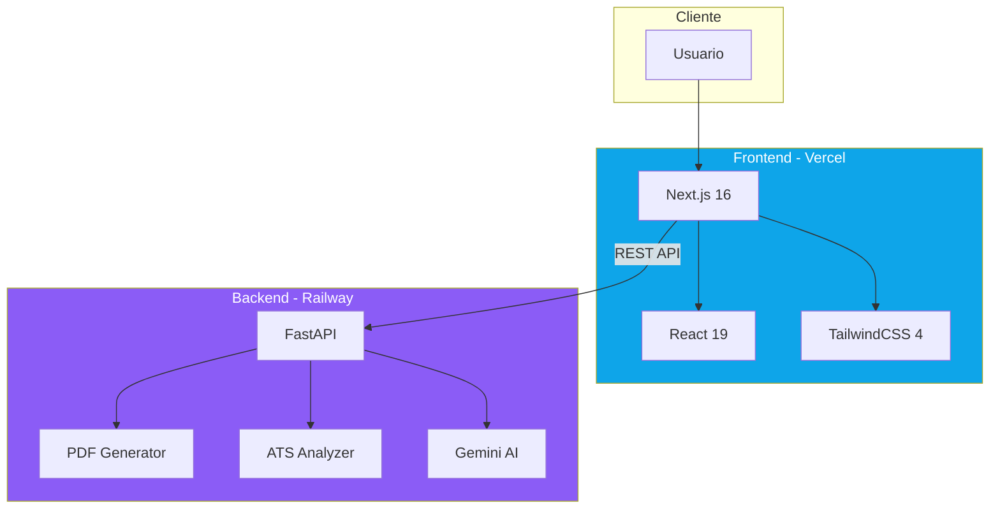
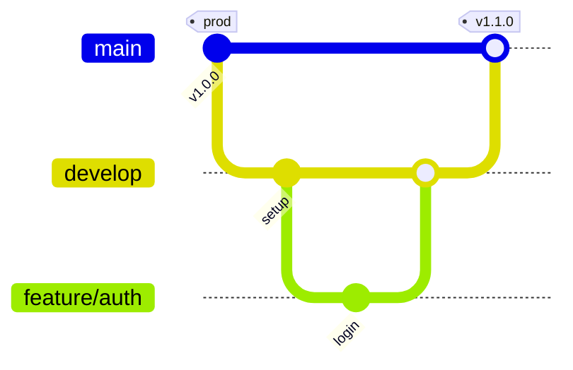
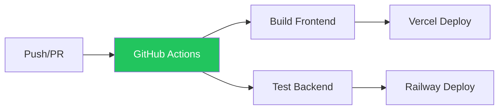

# cvOS - ATS CV Optimizer

> **Supera los filtros ATS. Consigue más entrevistas.**  
> Un producto de **Raido 2026**

[](https://github.com/Raido-co/cvos-platform/actions)

## Demo

| Ambiente | URL |
|----------|-----|
| Production | [cvos.raido.com.co](https://cvos.raido.com.co) |
| API | [cvos-platform-production.up.railway.app](https://cvos-platform-production.up.railway.app) |

---

## Contenido

1. [Arquitectura](#arquitectura)
2. [Stack Tecnológico](#stack-tecnológico)
3. [Git Flow](#git-flow)
4. [CI/CD](#cicd)
5. [Quick Start](#quick-start)
6. [Equipo](#equipo)

---

## Arquitectura



---

## Stack Tecnológico

| Categoría | Tecnología | Versión |
|-----------|------------|---------|
| Frontend | Next.js | 16.1 |
| Frontend | React | 19.2 |
| Frontend | TailwindCSS | 4.0 |
| Backend | Python | 3.11 |
| Backend | FastAPI | 0.109 |
| Backend | WeasyPrint | 67.0 |
| AI | Google Gemini | API |
| Hosting FE | Vercel | - |
| Hosting BE | Railway | - |

---

## Git Flow



| Branch | Propósito | Deploy |
|--------|-----------|--------|
| `main` | Producción | Vercel Prod + Railway |
| `develop` | Integración | Vercel Preview |
| `feature/*` | Nuevas features | Vercel Preview |

---

## CI/CD



| Job | Steps |
|-----|-------|
| `build-frontend` | checkout, npm ci, npm build |
| `test-backend` | pip install, pytest, pdf generation test |

---

## Quick Start

### Frontend
```bash
cd apps/web
npm install
npm run dev
```

### Backend
```bash
cd apps/api
pip install -r requirements.txt
uvicorn main:app --reload
```

---

## Estructura del Proyecto

```
apps/
├── web/                    # Frontend Next.js
│   ├── app/
│   │   ├── page.tsx        # Landing
│   │   ├── checker/        # ATS Checker
│   │   ├── dashboard/      # CV Wizard
│   │   ├── pricing/        # Planes
│   │   └── login/          # Auth
│   └── components/
│
└── api/                    # Backend FastAPI
    ├── main.py
    ├── pdf_generator.py
    ├── ats_checker.py
    └── templates/
        ├── cv_classic.html
        ├── cv_modern.html
        └── cv_executive.html
```

---

## Equipo

| Nombre | Rol |
|--------|-----|
| Will | DevSecOps |
| Santi | Security Engineer |
| Edgar | Developer |

---

*cvOS © 2026 — Raido*
