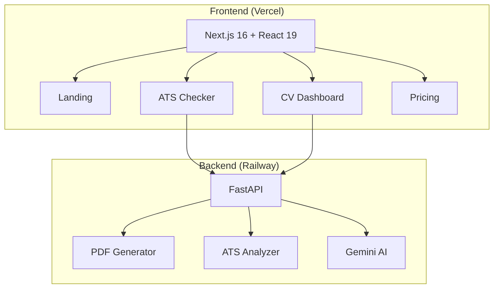

# 🚀 cvOS - ATS CV Optimizer

> **Supera los filtros ATS. Consigue más entrevistas.**  
> Un producto de **Raido 2026**

[](https://github.com/Raido-co/cvos-platform/actions)

## 🌐 Demo

- **Production:** [cvos.raido.com.co](https://cvos.raido.com.co)
- **API:** [cvos-platform-production.up.railway.app](https://cvos-platform-production.up.railway.app)

---

## 📊 Arquitectura



## 🛠️ Tech Stack

| Layer | Technology |
|-------|------------|
| Frontend | Next.js 16, React 19, TailwindCSS 4 |
| Backend | FastAPI, Python 3.11 |
| PDF Engine | WeasyPrint 67 |
| AI | Google Gemini API |
| Hosting | Vercel (FE) + Railway (BE) |
| CI/CD | GitHub Actions |

## 🚀 Quick Start

### Frontend
```bash
cd apps/web
npm install
npm run dev
```

### Backend
```bash
cd apps/api
pip install -r requirements.txt
uvicorn main:app --reload
```

## 🌿 Git Flow

See [GIT_FLOW.md](./GIT_FLOW.md) for branching strategy.

```
main (production) ← develop ← feature/*
```

## 📁 Project Structure

```
apps/
├── web/                    # Next.js Frontend
│   ├── app/
│   │   ├── page.tsx        # Landing
│   │   ├── checker/        # ATS Checker
│   │   ├── dashboard/      # CV Wizard
│   │   ├── pricing/        # Plans
│   │   └── login/          # Auth
│   └── components/
│
└── api/                    # FastAPI Backend
    ├── main.py             # API Routes
    ├── pdf_generator.py    # CV PDF Generation
    ├── ats_checker.py      # ATS Analysis
    └── templates/          # CV HTML Templates
        ├── cv_classic.html
        ├── cv_modern.html
        └── cv_executive.html
```

## 💰 Pricing Tiers

| Plan | Price | Features |
|------|-------|----------|
| Free | $0 | 3 CVs/month, Classic template |
| Pro | $3/mo | Unlimited CVs, 5+ templates, AI |
| Business | $10/mo | All Pro + API access |

## 🔜 Roadmap

- [ ] Authentication (NextAuth + OAuth)
- [ ] Payment integration (Stripe)
- [ ] Template selector in Dashboard
- [ ] Live CV preview
- [ ] Form validation

## 👥 Team

**Raido 2026**
- Will - Lead Developer
- Santi - Security Engineer
- Edgar - Developer

---

*cvOS © 2026 — Powered by [Raido](https://raido.com.co)*
